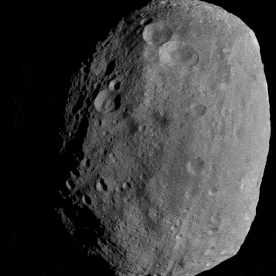
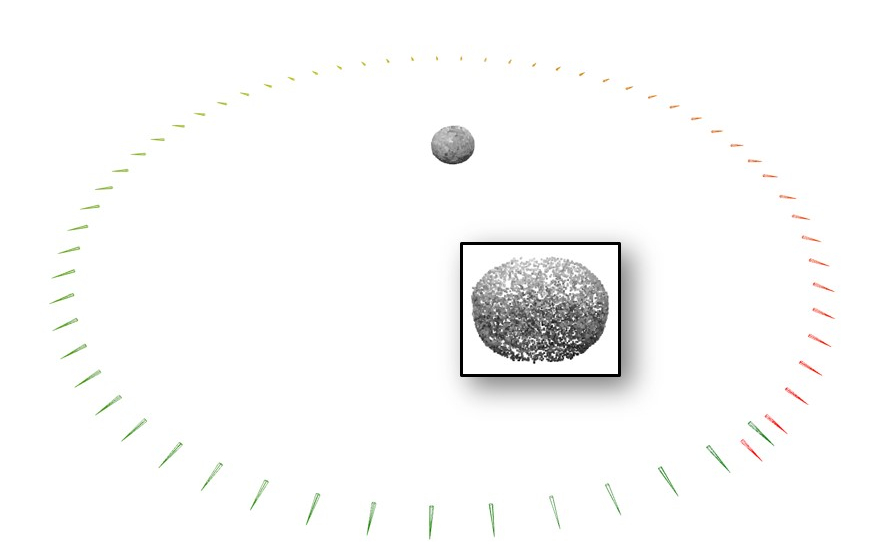

# Space Imaging Workshop SfM Demo

GTSfM reconstruction demos presented at the [3rd Space Imaging Workshop](https://seal.ae.gatech.edu/workshop-2022) for our work _Deep Feature Detection and Description for Small Body Relative Navigation_ (Paper SIW22-13), by [Travis Driver](https://travisdriver.github.io/), [Katherine Skinner](https://robotics.umich.edu/profile/katherine-skinner/), [Mehregan Dor](https://scholar.google.com/citations?user=gnhS-GAAAAAJ&hl=en), and [Panagiotis Tsiotras](https://dcsl.gatech.edu/tsiotras.html).

Please refer to the Google Colaboratory notebook for details.

